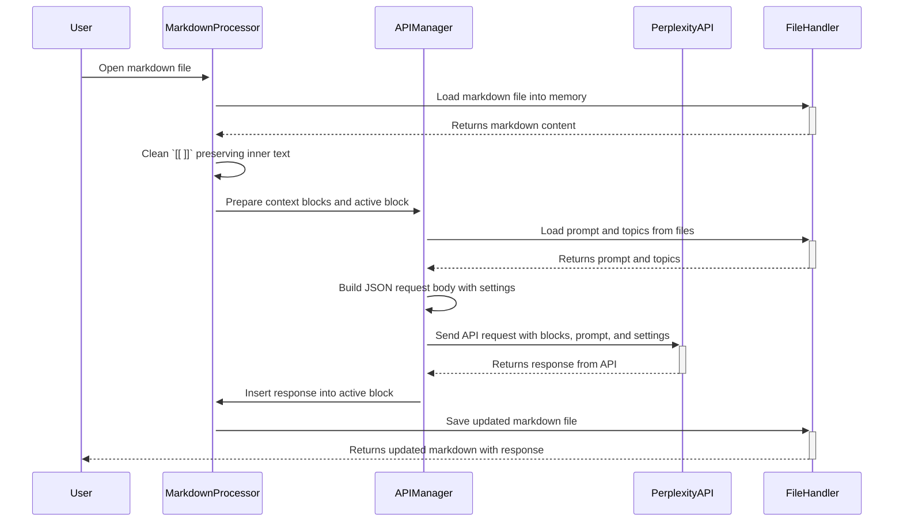

# Logseq Perplexity API Integration Project

This project integrates Logseq markdown files with the Perplexity API to clean up knowledge graph links, process complex prompts, and embed responses into markdown. The project follows a Test-Driven Development (TDD) approach with Rust, ensuring robust, scalable, and maintainable code.

## Project Overview

The goal of this project is to:
1. Remove double square brackets `[[ ]]` from Logseq markdown files while preserving the text inside.
2. Send specific blocks of text, along with the context (previous 2 and next 2 blocks), to the Perplexity API.
3. Incorporate the Perplexity API's response back into the markdown file, encapsulating the response in code fences.
4. Handle prompts and topics loaded from external files (markdown and CSV).
5. Use Rust best practices and idiomatic code design, while following a test-driven approach.

## Features

- **Logseq Link Cleanup**: Cleans up `[[ ]]` links from markdown while preserving the text inside.
- **API Integration**: Interfaces with the Perplexity API, sending complex prompts and settings alongside markdown content.
- **Contextual Block Handling**: Sends a block of markdown with surrounding context to the API for processing.
- **Test-Driven Development (TDD)**: The project is designed with a TDD approach, ensuring that all functionality is tested before implementation.
- **Sequence Diagram**: Detailed data flow visualization using Mermaid diagrams to track the operation flow.

## Sequence Diagram

Below is the Mermaid sequence diagram that details the interactions between the various components of the project.



This diagram outlines the key interactions between markdown processing, API communication, and the file handling lifecycle.

## Project Directory Structure

The project follows a clean and modular directory structure for ease of navigation and future scalability:

```
project/
│
├── Cargo.toml               # Rust project configuration and dependencies
├── .gitignore               # Files and directories to be ignored by Git
├── src/                     # Main source code directory
│   ├── main.rs              # Entry point for the project
│   └── lib.rs               # Library containing core logic
│
├── tests/                   # Tests directory
│   └── test_main.rs         # Unit and integration tests
│
├── logs/                    # Log files and output
│   └── .keep                # Placeholder file to keep directory in Git
│
└── docs/                    # Documentation and related materials
```

- **`src/main.rs`**: This is the entry point of the project where execution starts.
- **`src/lib.rs`**: Contains core functions like processing the markdown and calling the Perplexity API.
- **`tests/test_main.rs`**: Contains unit and integration tests following TDD principles.
- **`logs/`**: Stores logs generated during execution.
- **`docs/`**: Contains relevant project documentation and sequence diagrams.

## Getting Started

### Prerequisites

- **Rust**: Ensure you have Rust installed. You can install Rust by following the instructions at [rust-lang.org](https://www.rust-lang.org/tools/install).
- **Cargo**: Rust’s package manager, which comes installed with Rust.
- **Git**: Ensure Git is installed for version control.

### Setup

1. Clone this repository:

   ```bash
   git clone https://github.com/yourusername/logseq-perplexity-integration.git
   cd logseq-perplexity-integration
   ```

2. Run the setup script to initialize the environment:

   ```bash
   ./setup_project.sh
   ```

3. Install the dependencies:

   ```bash
   cargo build
   ```

### Running the Application

To run the project:

```bash
cargo run
```

This will execute the main functionality of cleaning markdown files and preparing them for API interaction.

### Running Tests

To run the tests using the TDD approach:

```bash
cargo test
```

This will execute all unit and integration tests, ensuring the robustness of the system.

## Contributing

1. Fork the repository.
2. Create a feature branch (`git checkout -b feature-name`).
3. Commit your changes (`git commit -am 'Add feature'`).
4. Push to the branch (`git push origin feature-name`).
5. Open a Pull Request.

## License

This project is licensed under the MIT License. See the [LICENSE](LICENSE) file for details.

